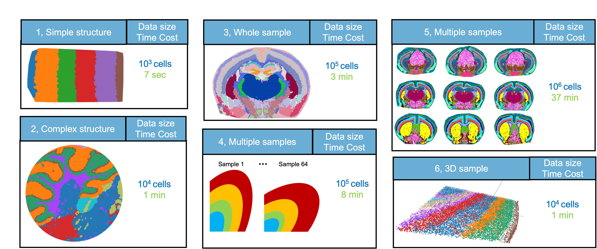

## Note!!!

The code in this repo has been provided to reviewers as a zip file. To install it, please follow [**Installation**](https://ms-doc.readthedocs.io/en/latest/installation/installation.html) (just replace the git clone step with decompressing the zip file).

## Overall

 MS is a Million-scalability and Stable method for identifying tissue structures without supervision.

 Find installation and tutorial in the [**Tutorial**](https://ms-doc.readthedocs.io/en/latest/)

### Developer: Zhiyuan Yuan (zhiyuan AT fudan DOT edu DOT cn) 
 

## SODB overview

## Key resources
For how to use the "**Result Exploration**" in the following table, please find in the manuscript "**Online assessing the results of MS**" in "**Methods**" section.
 To reproduce the result, the raw data should be downloaded first, by either 
- assessing via "**Data Availability**" in the manuscript, 
 or 
- loading using [**pysodb**](https://pysodb.readthedocs.io/en/latest/), for detail, please find "**Raw data loading via SODB**" in "**Methods**" section in the manusctipt.

  Following links in **Code** shows detailed pipelines on how to load data using **pysodb** and analysis using **MS**

|  Characteristics |  Dataset ID   |  Figure | Code |  Result Exploration|
| :------------: | :------------: | :------------: |:------------: |:------------: |
| Small data, Single slide| Dataset1 | Figure 2 |[Link](https://ms-doc.readthedocs.io/en/latest/single_slice/Dataset1.html)| [Link](https://gene.ai.tencent.com/SpatialOmics/dataset?datasetID=169)|
| Small data, Single slide| Dataset2 | Figure 2 |[Link](https://ms-doc.readthedocs.io/en/latest/single_slice/Dataset2.html)|[Link](https://gene.ai.tencent.com/SpatialOmics/dataset?datasetID=170)|
| Small data, Single slide | Dataset3 | Figure 2 |[Link](https://ms-doc.readthedocs.io/en/latest/single_slice/Dataset3.html)|[Link](https://gene.ai.tencent.com/SpatialOmics/dataset?datasetID=171)|
| Small data, Single slide | Dataset4 | Figure 2 | [Link](https://ms-doc.readthedocs.io/en/latest/single_slice/Dataset4.html)|[Link](https://gene.ai.tencent.com/SpatialOmics/dataset?datasetID=172)|
|Small data, Single slide | Dataset5 | Figure 2 | [Link](https://ms-doc.readthedocs.io/en/latest/single_slice/Dataset5.html)|[Link](https://gene.ai.tencent.com/SpatialOmics/dataset?datasetID=173)|
|Small data, Single slide | Dataset6 | Figure 2 | [Link](https://ms-doc.readthedocs.io/en/latest/single_slice/Dataset6.html)|[Link](https://gene.ai.tencent.com/SpatialOmics/dataset?datasetID=174)|
|Small data, Single slide | Dataset7 | Figure 2 | [Link](https://ms-doc.readthedocs.io/en/latest/single_slice/Dataset7.html)|[Link](https://gene.ai.tencent.com/SpatialOmics/dataset?datasetID=175)|
|Small data, Single slide | Dataset8 | Figure 2 | [Link](https://ms-doc.readthedocs.io/en/latest/single_slice/Dataset8.html)|[Link](https://gene.ai.tencent.com/SpatialOmics/dataset?datasetID=176)|
|Large data, Single slice | Dataset9 | Figure 3 | [Link](https://ms-doc.readthedocs.io/en/latest/single_slice/Dataset9.html)|[Link](https://gene.ai.tencent.com/SpatialOmics/dataset?datasetID=177)|
|Large data, Single slice | Dataset10 | Figure 3 | [Link](https://ms-doc.readthedocs.io/en/latest/single_slice/Dataset10.html)|[Link](https://gene.ai.tencent.com/SpatialOmics/dataset?datasetID=178)|
|Small data, Multiple slice | Dataset11 | Figure 4 |[Link](https://ms-doc.readthedocs.io/en/latest/multi_slice/Dataset11.html) |[Link](https://gene.ai.tencent.com/SpatialOmics/dataset?datasetID=179)|
|Huge data, Multiple slice | Dataset12 | Figure 5,7 | [Link](https://ms-doc.readthedocs.io/en/latest/multi_slice/Dataset12.html)|[Link](https://gene.ai.tencent.com/SpatialOmics/dataset?datasetID=180)|
|Huge data, Multiple slice | Dataset13 | Figure 6,7 | [Link](https://ms-doc.readthedocs.io/en/latest/multi_slice/Dataset13.html)|[Link](https://gene.ai.tencent.com/SpatialOmics/dataset?datasetID=181)|
|Large data, Single slice, 3D | Dataset14 | Figure 1 | [Link](https://ms-doc.readthedocs.io/en/latest/single_slice/Dataset14.html)|[Link](https://gene.ai.tencent.com/SpatialOmics/dataset?datasetID=183)|

## Cite

TBD

